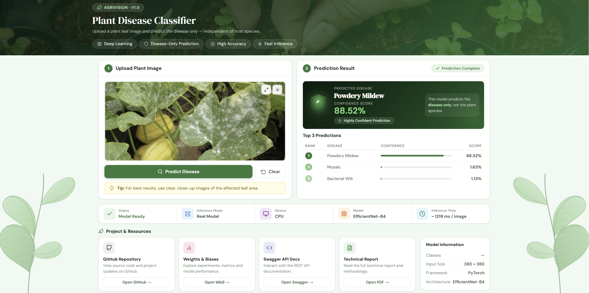
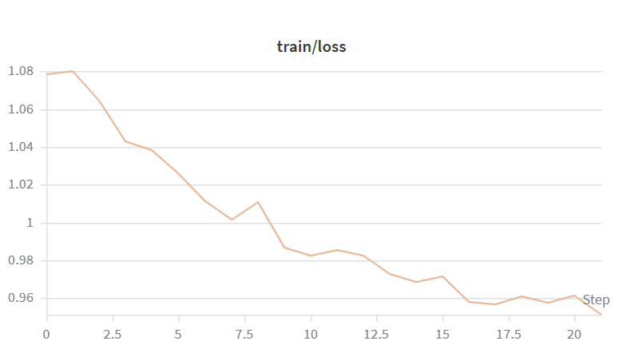
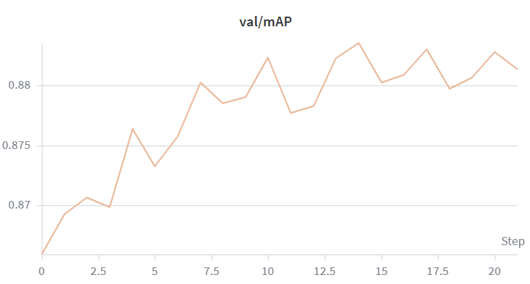

# 🌿 AgriVision: Host-Agnostic Plant Disease Classifier
### (Powered by Mroot AI Engine)


**AgriVision** is a high-performance, plant-agnostic computer vision system designed to identify plant diseases regardless of the host species. Unlike conventional models that learn compound labels such as "Apple Scab", this system decouples the pathology from the host plant, predicting the **disease only**.

---

## Live Demo and API (Dockerized)

The system is deployed as a **fully containerized Docker application** on Hugging Face Spaces. This ensures the environment is reproducible and ready for on-premise hosting.

- **Web Interface:** [sonamans/AgriVision](https://huggingface.co/spaces/sonamans/AgriVision)
- **REST API Documentation (Swagger):** [sonamans/AgriVision/docs](https://sonamans-agrivision.hf.space/docs)

---

## Demo Preview

 

---

## Methodology

### Label Consolidation — Dynamic Prefix Heuristic
To satisfy the host-agnostic requirement, folder names are parsed at runtime using a longest-common-prefix heuristic that strips the plant name and retains only the disease token:
- `tomato late blight` + `potato late blight` ➔ **`late blight`**
- `bell pepper powdery mildew` + `cherry powdery mildew` ➔ **`powdery mildew`**

### Training Strategy
- **Architecture:** EfficientNet-B4, selected for its optimal accuracy-to-parameter ratio.
- **Two-phase schedule:** Backbone frozen for the first 3 epochs, followed by full fine-tuning with differential learning rates (backbone: 1.5e-5, head: 1.5e-4).
- **Scheduler:** Cosine Annealing for smooth convergence.
- **Regularization:** Label smoothing (0.1) and CoarseDropout to reduce overfitting.
- **Inference:** Test-time augmentation (TTA) over 5 geometric variants for improved robustness.

---

## Results

| Metric | Value |
|--------|-------|
| Best Validation mAP | **88.35%** |
| Final Inference Accuracy (with TTA) | **~92.1%** |
| Hardware | Tesla T4 GPU (Training) / Docker CPU (Inference) |

👉 **[View Full Experiment Logs on W&B](https://wandb.ai/mansuryansona04-npua/plant-disease-clf)**

| Training Loss | Validation mAP |
|---------------|----------------|
|  |  |

---

## Project Structure
```text
plant-disease-classifier/
├── api/
│   └── main.py            # FastAPI production server
├── notebooks/
│   └── training.ipynb     # Original Colab research notebook
├── reports/               # Visualization assets (Loss, mAP, Predictions)
├── scripts/
│   └── ablation.py        # Backbone architecture comparison
├── config.py              # Global hyperparameters
├── dataset.py             # Dataset class and prefix heuristic
├── model.py               # DiseaseClassifier architecture
├── predict.py             # Inference engine (TTA supported)
├── transforms.py          # Albumentations pipelines
├── utils.py               # Seeding and visualization utilities
├── requirements.txt       # Dependency list
└── Dockerfile             # Containerization for deployment
```

---

## Installation and Usage

**Setup**
```bash
git clone https://github.com/sonamansuryan/plant-disease-classifier.git
cd plant-disease-classifier
pip install -r requirements.txt
```

**Training**
```bash
python train.py
```

**Inference (CLI)**
```bash
python predict.py --image path/to/leaf.jpg --ckpt path/to/best_model.pth --tta
```

---

## Model Weights
The trained weights are hosted on Hugging Face to satisfy technical hosting requirements and allow easy integration.
- **File:** `best_model.pth`
- 🔗 **[Download from Hugging Face Space Files](https://huggingface.co/spaces/sonamans/AgriVision/tree/main)**

---

## Technical Report
A comprehensive academic-style report covering methodology, ablation studies, and results is included in the repository.

👉 **[View Technical Report (PDF)](./Technical_Report_AgriVision.pdf)**
